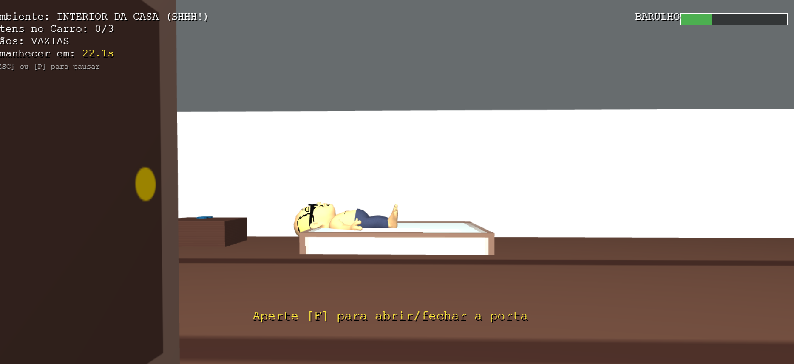
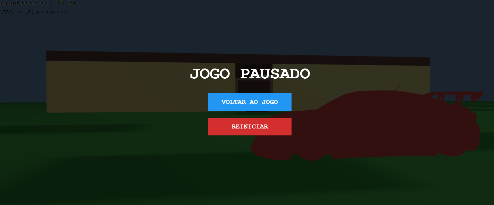
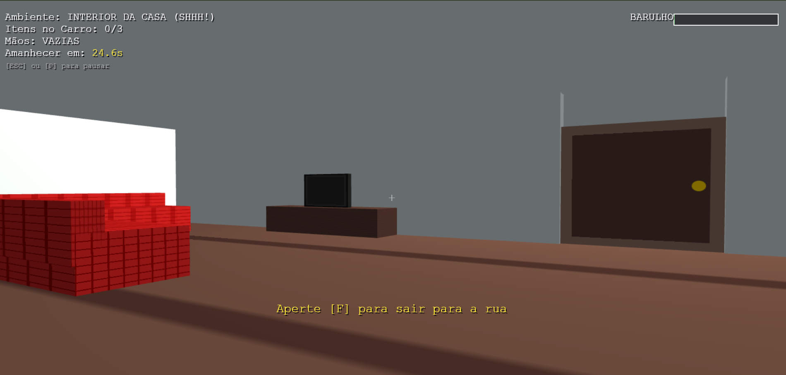
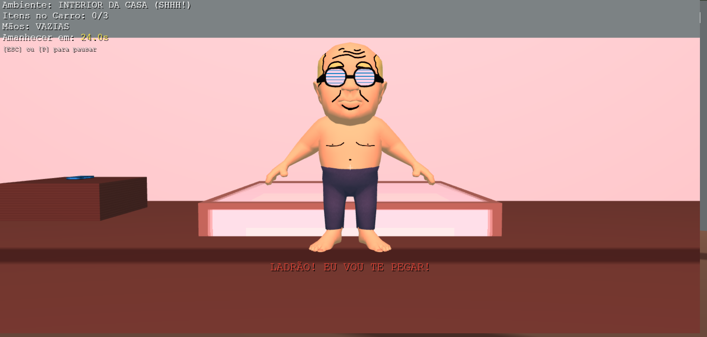
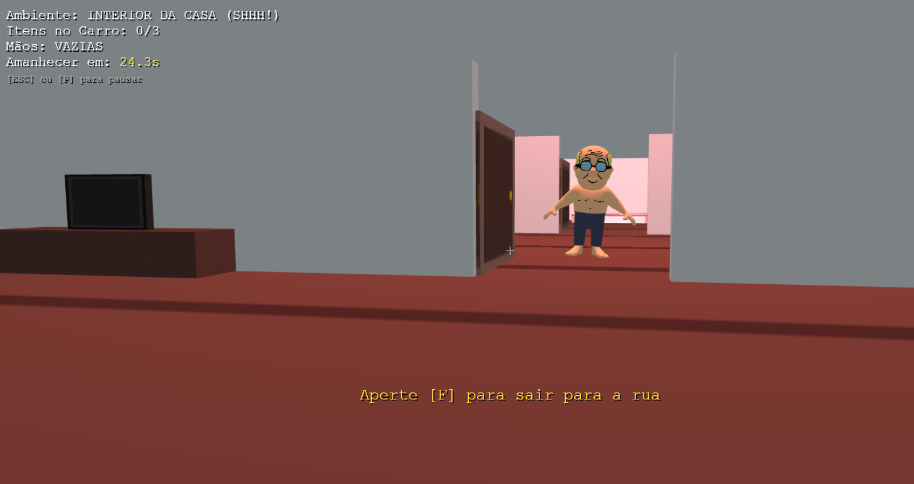

# Stealth Horror: A Invasão Noturna 

**Universidade Estadual do Ceará (UECE)**  
**Disciplina:** Computação Gráfica  
**Professor:** Matheus  
**Desenvolvedores:** Hyan  e Yasmin

---

## 📌 Sobre o Projeto

**"A Invasão Noturna"** é um jogo 3D de *Stealth Horror* em primeira pessoa desenvolvido inteiramente do zero utilizando **WebGL 2.0 puro**, HTML5 Canvas e JavaScript. O projeto dispensa o uso de engines gráficas de alto nível (como Three.js ou Unity), implementando toda a pipeline gráfica, matemática de matrizes, iluminação e leitura de malhas 3D diretamente no código-fonte.

O objetivo do jogador é invadir uma casa durante a noite, roubar 3 objetos de valor (TV, Celular e Colar) e guardá-los no porta-malas do carro de fuga. Mas há um problema: o dono da casa está dormindo, e qualquer passo em falso pode ser fatal.

---

##  Imagens do Jogo

  
  
  
    
  
  

---

##  Mecânicas de Gameplay

* **Sistema de Stealth (Barulho):** Movimentar-se continuamente gera ruído. Uma barra de tensão no HUD indica o quão perto o Vovô está de acordar. Parar de andar faz a barra esvaziar.
* **Inventário Limitado:** O jogador só pode carregar um item roubado por vez, forçando-o a fazer um percurso de "vai e vem" entre o interior da casa e o carro estacionado no quintal.
* **Timer de Amanhecer:** O cronômetro de 30 segundos não para! Se o cronômetro zerar, o sol nasce e o Vovô acorda instantaneamente.
* **Inteligência Artificial (Máquina de Estados):** O Vovô possui estados lógicos (`DORMINDO`, `ACORDANDO`, `CAÇANDO`). Ao acordar, ele utiliza trigonometria (`Math.atan2`) para rotacionar dinamicamente e encarar o jogador, calculando vetores de direção para persegui-lo pela casa.
* **Limites de IA:** O Vovô está restrito ao interior da casa. Caso o jogador consiga cruzar a porta da frente, ele fica a salvo no gramado.

---

##  Mapeamento de Requisitos

Este projeto foi construído garantindo o atendimento integral de todos os critérios estabelecidos para a categoria **Jogo 3D**, bem como as restrições anotadas em sala de aula. Abaixo está o detalhamento técnico de onde e como cada requisito foi implementado no código-fonte (`teste.html`).

##  Conformidade com os Requisitos do Edital

O código-fonte (`ORoubo.html`) foi estruturado para atender e superar as exigências técnicas da avaliação. Abaixo está o mapeamento detalhado de como as funcionalidades foram implementadas na arquitetura.

### a) Requisitos Gerais (Obrigatórios)

* **I) Movimentação de câmera com projeção perspectiva:** A câmera funciona em primeira pessoa, permitindo rotação por mouse (`yaw` e `pitch`) e deslocamento pelas teclas WASD. A projeção perspectiva foi construída manualmente através da função matemática abstrata `manualPerspective()`.
* **II) Sistema de iluminação utilizando o modelo de reflexão de Phong, com movimentação de pelo menos uma fonte de luz:** O pipeline conta com um *Fragment Shader* autoral que processa as componentes **Ambiente**, **Difusa** e **Especular** (utilizando a posição da câmera). A fonte de luz (`u_lightPos`) oscila geometricamente pela cena ao longo do tempo (usando funções trigonométricas no laço de renderização).
* **III) Pelo menos um objeto animado por meio de transformações geométricas:** O NPC inimigo possui ciclos de translação e rotação em tempo real durante o estado de "caça". Adicionalmente, as portas da casa possuem eixos rotacionais (dobradiças) acionados por interação.
* **IV) Pelo menos um objeto com textura:** O mapeamento UV foi aplicado amplamente no cenário, abrangendo chão, paredes, teto e mobílias, com texturas geradas dinamicamente ou importadas de descritores MTL.
* **V) Pelo menos um objeto com cor sólida:** Para cumprir este requisito, um cofre vermelho foi inserido no interior da casa. Um controle dinâmico no Shader (`u_useSolid`) desabilita a amostragem de texturas e injeta um vetor de cor RGBA puro sobre a iluminação do Phong.
* **VI) O desenho da cena deve ser feito exclusivamente com OpenGL (≥4.0) ou WebGL puros:** Nenhuma *engine* gráfica (como Three.js) foi utilizada. A renderização é feita chamando métodos nativos do contexto `webgl2`.
* **VI) É permitido apenas o uso de bibliotecas auxiliares para Álgebra Linear:** O código faz uso isolado da biblioteca `gl-matrix`, restrita à computação de vetores e produto de matrizes.
* **VII) É permitida a criação de contexto gráfico via Canvas (HTML5):** Toda a inicialização é hospedada diretamente na tag `<canvas>`.
* **VIII) É permitido utilizar bibliotecas extras apenas para captura de eventos de teclado e mouse:** O projeto utiliza estritamente `Vanilla JavaScript` (eventos de teclado e a *Pointer Lock API* nativa do DOM).

### c) Requisitos Específicos do Jogo 3D

* **I) Tipo de câmera livre (primeira ou terceira pessoa), desde que haja movimentação pelo ambiente:** Implementada câmera FPS com controle ininterrupto via captura de ponteiro, permitindo trânsito orgânico entre ambientes (exterior e interior).
* **II) O jogo deve conter objetos 3D carregados a partir de arquivos OBJ:** Os arquivos externos `vovo.obj` e `car.obj` populam o cenário.
* **III) É obrigatória a implementação própria de um leitor de arquivos OBJ:** Foi desenvolvida do zero a rotina assíncrona `carregarModeloOBJ()`, que efetua o *parse* textual de vértices, normais e texturas.
* **IV) É permitido utilizar modelos gratuitos da internet:** Os modelos estáticos complexos da cena operam sob esta prerrogativa.
* **V) Não é obrigatório criar modelos autorais:** Prerrogativa devidamente observada, mantendo o foco na engine e leitura lógica dos dados.

### Exceção Técnica: Requisitos Opcionais Aplicados (Leitor de OBJ)

Para legitimar o carregamento dos assets do jogo, os requisitos opcionais foram integralmente cumpridos:
* **V) Implementar um leitor próprio do formato OBJ:** O algoritmo lê ativamente os descritores textuais (`v`, `vt`, `vn`, `f`), cruza os índices geométricos e aloca buffers estruturados para a GPU.
* **VII) Uso permitido de modelos externos criados em softwares:** Devido à existência do leitor autoral (descrito acima), os modelos gerados em Blender e importados são totalmente lícitos.
* **VIII) Proibição de funções de terceiros para leitura de OBJ:** Nenhuma extensão, biblioteca ou *loader* pré-fabricado foi utilizado. O algoritmo consome o arquivo através de `fetch API` e o manipula utilizando expressões regulares nativas do JavaScript.

### Anotações Extras (Parâmetros Manuais de Sala de Aula)

Para corresponder às exigências complementares estabelecidas durante as aulas teóricas, as seguintes abordagens *manuais* ou *nativas* foram asseguradas no código:
* **Look_At (Manual):** Matriz de visão construída algebricamente na função `manualLookAt()`.
* **Perspective (Manual):** Construção independente na função `manualPerspective()`.
* **Shaders (Vertex e Fragment):** Programados interativamente na linguagem GLSL diretamente no escopo global do projeto.
* **Z-Buffer e Cull Face:** Contemplados através das ativações de estado `gl.DEPTH_TEST` e `gl.CULL_FACE`.
---

##  Como Executar o Projeto

Como o jogo utiliza requisições assíncronas (Fetch API) para carregar as texturas e os modelos 3D (`.obj` e `.mtl`), as políticas de segurança do navegador (CORS) impedem que o arquivo seja aberto diretamente via duplo-clique.

1. Baixe os arquivos do projeto e certifique-se de que o `index.html`, os modelos (`vovo.obj`, `car.obj`, `Rak_OBJ.mtl`) e todas as imagens `.png` estão no **mesmo diretório**.
2. Abra a pasta no **VS Code**.
3. Instale a extensão **Live Server**.
4. Clique com o botão direito no arquivo `index.html` e selecione **"Open with Live Server"**.

---

##  Controles

* `W, A, S, D` - Movimentação do personagem.
* `Mouse` - Controle de Câmera (Look around).
* `F` - Interagir com portas (Arrombar/Entrar/Sair).
* `E` - Interagir com os itens (Roubar objeto / Guardar no carro).
* `ESC` ou `P` - Pausar o jogo / Liberar o cursor do mouse.